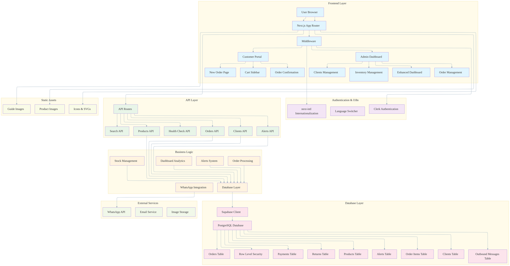

# Mobile For You - מובייל פור יו

A comprehensive, modern business management system designed specifically for mobile device distribution companies. Built with Next.js 15, TypeScript, and Supabase, this system streamlines inventory management, order processing, client relationships, and automated notifications with full Hebrew/English bilingual support.

[](https://nextjs.org/)
[](https://www.typescriptlang.org/)
[](https://supabase.com/)
[](https://clerk.com/)
[](https://www.twilio.com/)
[](https://next-intl-docs.vercel.app/)

## 🌟 What's New - Latest Updates

### 🎨 **Enhanced Admin Dashboard**
- **Modern KPI Cards**: Real-time business metrics with beautiful visual indicators
- **Interactive Charts**: 7-day sales trends and profit distribution by brand using Recharts
- **Top Performers**: Best-selling products and top clients with detailed analytics
- **Smart Alerts**: Low stock alerts and system notifications with WhatsApp integration
- **Quick Actions**: One-click access to inventory, orders, and client management

### 🌍 **Complete Internationalization (i18n)**
- **Hebrew-First Design**: Right-to-left (RTL) layout optimized for Hebrew users
- **Bilingual Support**: Full English and Hebrew translations throughout the app
- **Dynamic Language Switching**: Seamless language switching with persistent preferences
- **Localized Content**: All UI elements, messages, and data formatted for each locale

### 📱 **Advanced Product Management**
- **Enhanced Product Model**: Extended with B2B features including purchase prices, profit margins, and supplier information
- **Product Images**: Full image support with local storage and fallback handling
- **Promotional Products**: Special promotion highlighting and filtering
- **Smart Filtering**: Quick filter chips for promotions, best sellers, and runner models
- **Availability Badges**: Customer-friendly stock indicators instead of exact counts

### 👥 **Client Onboarding & Profile Management**
- **Smart Onboarding**: Automatic profile completion prompts for new clients
- **Enhanced Client Profiles**: Extended with phone, city, and shop name fields
- **Self-Service Updates**: Clients can update their own profile information
- **Admin Oversight**: Complete client management with detailed analytics

### 🔍 **Global Search System**
- **Unified Search**: Search across products and clients with Hebrew-friendly matching
- **Smart Results**: Grouped search results with relevance scoring
- **Real-time Search**: Instant search suggestions and results
- **Multi-language Support**: Search works in both Hebrew and English

### 📊 **Business Intelligence & Analytics**
- **Daily KPIs**: Revenue, cost, profit, and order metrics for today
- **Sales Trends**: 7-day sales visualization with interactive charts
- **Profit Analysis**: Brand-wise profit distribution and client profitability
- **Performance Metrics**: Top products and clients with detailed breakdowns

### 🛒 **Enhanced Order Management**
- **Multi-language Order Interface**: Fully translated order management in Hebrew and English
- **Status Tracking**: Visual status progression with Hebrew labels
- **Advanced Filtering**: Search and filter orders with localized interface
- **Order Analytics**: Detailed order history and performance tracking

### 🎯 **Promotions & Marketing**
- **Promotions Page**: Dedicated page for promotional products
- **Promotion Highlighting**: Special visual indicators for promotional items
- **Marketing Tools**: Quick access to promotional products and best sellers

## 🚀 Key Features

### 📊 **Advanced Admin Dashboard**
- **Real-time KPIs**: Live business metrics including revenue, cost, profit, and orders
- **Interactive Charts**: Sales trends and profit distribution with Recharts
- **Top Performers**: Best-selling products and top clients with detailed analytics
- **Smart Alerts**: Low stock alerts and system notifications
- **Quick Actions**: One-click access to all major functions
- **Responsive Design**: Optimized for desktop and mobile viewing

### 📱 **Comprehensive Inventory Management**
- **Enhanced Product Model**: B2B features with purchase prices, profit margins, and supplier info
- **Product Images**: Full image support with local storage and optimization
- **Multi-Category Support**: iPhone, Samsung, Android phones, tablets, smartwatches, earphones, chargers, cases, accessories
- **Condition Tracking**: New, refurbished, used, activated, and open-box items
- **Advanced Stock Management**: Real-time stock levels with reservation system
- **Smart Filtering**: Search by brand, model, category, condition, and stock levels
- **Bulk Operations**: Efficient inventory updates and mass operations
- **Automated Alerts**: Low stock notifications with configurable thresholds
- **Promotional Products**: Special handling and highlighting for promotional items

### 👥 **Complete Client Management**
- **Smart Onboarding**: Automatic profile completion for new clients
- **Enhanced Profiles**: Extended client information with business details
- **Self-Service Updates**: Clients can manage their own profile information
- **Integrated Authentication**: Seamless Clerk integration for client accounts
- **Purchase History**: Detailed transaction records with order analytics
- **Debt Management**: Outstanding balance tracking with automated reminders
- **Performance Metrics**: Client profitability analysis and engagement tracking

### 🛒 **Streamlined Order Processing**
- **Multi-language Interface**: Fully translated order management in Hebrew and English
- **Multi-Step Workflow**: Draft → Reserved → Delivered → Closed status progression
- **Real-time Updates**: Live order status tracking with instant notifications
- **Multi-Item Orders**: Complex order management with item-specific pricing
- **Stock Reservation**: Automatic stock reservation during order processing
- **Order History**: Complete audit trail with detailed item breakdowns
- **Admin Actions**: Quick order status updates and management

### 🛍️ **Enhanced Customer Portal**
- **Self-Service Ordering**: Customers can browse inventory and place orders independently
- **Product Catalog**: Full inventory browsing with advanced filtering
- **Product Images**: Visual product display with image optimization
- **Availability Badges**: Customer-friendly stock indicators (In Stock, Last Few, Out of Stock)
- **Shopping Cart**: Add/remove items with quantity management and stock validation
- **Order Tracking**: View order history, status updates, and order details
- **Mobile-Optimized**: Responsive design with floating actions
- **Promotional Highlighting**: Special visual indicators for promotional products

### 💰 **Financial Management**
- **Enhanced Profit Tracking**: Detailed cost and profit analysis per product and client
- **Payment Tracking**: Multiple payment methods with comprehensive records
- **Debt Monitoring**: Automated overdue payment detection with configurable thresholds
- **Receivables Dashboard**: Top debtors with outstanding amounts and days overdue
- **Financial Reports**: Revenue tracking and profit analysis
- **WhatsApp Reminders**: Automated payment reminder messages

### 🔔 **Smart Notifications System**
- **WhatsApp Integration**: Automated customer communications via Twilio
- **Multi-Channel Alerts**: Low stock, overdue payments, pending deliveries, new orders
- **Scheduled Automation**: Daily alerts and message dispatch via Vercel cron jobs
- **Template System**: Customizable message templates for different scenarios
- **Real-time Monitoring**: Live alert dashboard with severity levels
- **Alert Management**: Manual alert running and message dispatch controls

### 🔍 **Global Search System**
- **Unified Search**: Search across products and clients with intelligent matching
- **Hebrew-Friendly**: Optimized search for Hebrew text and transliterations
- **Smart Results**: Grouped search results with relevance scoring
- **Real-time Search**: Instant search suggestions and results
- **Multi-language Support**: Search works in both Hebrew and English

### 🎯 **Promotions & Marketing**
- **Promotions Page**: Dedicated page for promotional products
- **Promotion Highlighting**: Special visual indicators for promotional items
- **Marketing Tools**: Quick access to promotional products and best sellers
- **Filter Integration**: Easy filtering for promotional products

## 🛠️ Technology Stack

### **Frontend & UI**
- **Next.js 15** - React framework with App Router and server components
- **TypeScript 5.0** - Full type safety throughout the application
- **Tailwind CSS** - Utility-first CSS framework for responsive design
- **Lucide React** - Beautiful, customizable icons
- **Next-Intl** - Complete internationalization support for Hebrew/English
- **Recharts** - Interactive charts and data visualization

### **Backend & Database**
- **Supabase** - PostgreSQL database with real-time subscriptions and RLS
- **Row Level Security (RLS)** - Database-level security policies
- **Server Actions** - Secure server-side operations with automatic revalidation
- **Edge Runtime** - Optimized performance with global edge deployment

### **Authentication & Security**
- **Clerk** - Complete authentication solution with admin role management
- **Middleware Protection** - Route-level security with automatic redirects
- **Admin Access Control** - Email-based admin permissions
- **Client Auto-Creation** - Automatic client records from customer portal

### **Communication & Notifications**
- **Twilio WhatsApp API** - Business messaging platform with sandbox support
- **Vercel Cron Jobs** - Scheduled task automation for alerts and messaging
- **Template Engine** - Dynamic message generation with variables
- **Outbound Message Tracking** - Complete message delivery and status tracking

### **Deployment & Infrastructure**
- **Vercel** - Optimized hosting platform with edge functions
- **Environment Management** - Secure configuration handling
- **Database Migrations** - Version-controlled database schema updates

## 🏗️ System Architecture

The following diagram illustrates the complete system architecture and data flow of Mobile For You:



### **Architecture Overview**

The system follows a modern, layered architecture with clear separation of concerns:

- **Frontend Layer**: Next.js 15 with App Router, providing both admin and customer interfaces
- **Authentication & I18n**: Clerk for secure authentication and next-intl for bilingual support
- **API Layer**: RESTful APIs handling all business operations
- **Business Logic**: Core business rules and data processing
- **Database Layer**: Supabase with PostgreSQL, featuring Row Level Security
- **External Services**: WhatsApp integration and email notifications
- **Static Assets**: Optimized image delivery and static content

## 📋 Prerequisites

Before you begin, ensure you have the following installed and configured:

- **Node.js 18+** - JavaScript runtime environment
- **npm or yarn** - Package manager
- **Git** - Version control system
- **Supabase Account** - Database and backend services
- **Clerk Account** - Authentication services
- **Twilio Account** - WhatsApp messaging (optional for notifications)

## ⚡ Quick Start

### 1. **Clone & Install**
```bash
# Clone the repository
git clone https://github.com/AdirBuskila/mobileforyou.git
cd mobileforyou

# Install dependencies
npm install
```

### 2. **Environment Configuration**
Create a `.env.local` file in the root directory:

```env
# Clerk Authentication (Required)
NEXT_PUBLIC_CLERK_PUBLISHABLE_KEY=pk_test_...
CLERK_SECRET_KEY=sk_test_...
ADMIN_EMAILS=admin@yourcompany.com,owner@yourcompany.com

# Supabase Database (Required)
NEXT_PUBLIC_SUPABASE_URL=https://your-project.supabase.co
NEXT_PUBLIC_SUPABASE_ANON_KEY=eyJhbGciOiJIUzI1NiIsInR5cCI6IkpXVCJ9...
SUPABASE_SERVICE_ROLE_KEY=eyJhbGciOiJIUzI1NiIsInR5cCI6IkpXVCJ9...

# Application Configuration
NEXT_PUBLIC_APP_URL=http://localhost:3001

# WhatsApp/Twilio Notifications (Optional)
WHATSAPP_PROVIDER=twilio
WHATSAPP_TEST_MODE=true
TWILIO_ACCOUNT_SID=AC...
TWILIO_AUTH_TOKEN=your_auth_token
TWILIO_WHATSAPP_FROM=whatsapp:+14155238886

# Alert Configuration (Optional)
ALERT_UNDELIVERED_DAYS=3
ALERT_OVERDUE_DAYS=14
ALERT_RESERVED_STALE_DAYS=3

# Admin Notifications (Optional)
ADMIN_PHONE=+972546093624
```

### 3. **Database Setup**
Run the database schema in your Supabase SQL editor:

1. **Main Schema**: Copy and paste `database/schema.sql` (includes all tables, triggers, and RLS policies)

### 4. **Start Development Server**
```bash
npm run dev
```

### 5. **Access the Application**
- **English**: [http://localhost:3001/en](http://localhost:3001/en)
- **Hebrew**: [http://localhost:3001/he](http://localhost:3001/he)

## 🌍 Internationalization (i18n)

The application provides complete bilingual support:

### **Supported Languages**
- **English** (en) - Default language
- **Hebrew** (he) - Right-to-left (RTL) layout optimized

### **Language Features**
- **Dynamic Switching**: Seamless language switching with persistent preferences
- **RTL Support**: Complete right-to-left layout for Hebrew
- **Localized Content**: All UI elements, messages, and data formatted for each locale
- **Search Optimization**: Hebrew-friendly search with transliteration support
- **Date/Time Formatting**: Locale-specific date and time formatting

### **Adding New Languages**
To add a new language:
1. Create a new translation file in `src/i18n/messages/`
2. Add the locale to `src/i18n/config.ts`
3. Update the `LanguageSwitcher` component

## 📊 Database Schema

The application uses a comprehensive database schema with the following main tables:

### **Core Tables**
- **products**: Enhanced product inventory with B2B features, images, and promotional flags
- **clients**: Client information with extended profile fields and business details
- **orders**: Order management with status tracking and total pricing
- **order_items**: Individual items within orders with quantities and pricing
- **payments**: Payment records and debt tracking by client
- **returns**: Return and trade-in processing

### **System Tables**
- **alerts**: System alerts with severity levels and acknowledgment tracking
- **outbound_messages**: WhatsApp message tracking and delivery status

### **Key Features**
- **Automatic Timestamps**: Created/updated timestamps on all records
- **UUID Primary Keys**: Secure, non-sequential identifiers
- **Foreign Key Constraints**: Data integrity and referential consistency
- **Row Level Security**: Database-level access control
- **Enum Types**: Controlled vocabularies for statuses, categories, and conditions
- **B2B Enhancements**: Extended product model with business features

## 📁 Project Structure

```
src/
├── app/                           # Next.js app router pages
│   ├── [locale]/                  # Internationalized routes
│   │   ├── inventory/             # Inventory management page
│   │   ├── clients/               # Client management page
│   │   ├── orders/                # Order management page
│   │   ├── returns/               # Returns management page
│   │   ├── alerts/                # Alerts and notifications page
│   │   ├── promotions/            # Promotions page
│   │   ├── search/                # Global search page
│   │   ├── customer/              # Customer portal pages
│   │   │   ├── new-order/         # New order creation
│   │   │   └── orders/            # Order history and tracking
│   │   └── page.tsx               # Main dashboard
│   ├── api/                       # API routes
│   │   ├── orders/                # Order CRUD operations
│   │   ├── products/              # Product management
│   │   ├── alerts/                # Alert management
│   │   ├── search/                # Global search API
│   │   ├── clients/               # Client management API
│   │   ├── consignments/          # Consignment tracking API
│   │   ├── run-alerts/            # Manual alert execution
│   │   └── dispatch-messages/     # WhatsApp message dispatch
│   └── globals.css                # Global styles
├── components/                    # React components
│   ├── Layout.tsx                 # App layout with sidebar
│   ├── EnhancedDashboard.tsx      # Modern admin dashboard
│   ├── KpiCard.tsx                # Dashboard KPI cards
│   ├── InventoryManagement.tsx    # Inventory CRUD operations
│   ├── OrderManagement.tsx        # Order processing
│   ├── ClientsManagement.tsx      # Client management
│   ├── AlertsBell.tsx             # Alerts notification bell
│   ├── ClientOnboardingModal.tsx  # Client profile completion
│   ├── ClientRedirect.tsx         # Client routing logic
│   ├── Footer.tsx                 # App footer
│   ├── LanguageSwitcher.tsx       # Language switching
│   └── customer/                  # Customer portal components
│       ├── CustomerDashboard.tsx  # Customer home page
│       ├── NewOrderPage.tsx       # Order creation interface
│       ├── NewOrderProductList.tsx # Product catalog
│       ├── CartSidebar.tsx        # Shopping cart
│       └── OrderConfirmation.tsx  # Order confirmation
├── lib/                           # Utility functions
│   ├── database.ts                # Database operations and queries
│   ├── dashboard.ts               # Dashboard-specific queries
│   ├── supabase.ts                # Supabase configuration
│   ├── alerts.ts                  # Alert system logic
│   ├── whatsapp.ts                # WhatsApp integration
│   └── utils.ts                   # Helper functions
├── types/                         # TypeScript type definitions
│   └── database.ts                # Database schema types
└── i18n/                          # Internationalization
    ├── messages/                  # Translation files
    │   ├── en.json                # English translations
    │   └── he.json                # Hebrew translations
    └── config.ts                  # i18n configuration
```

## 🎯 Key Features Implementation

### **Enhanced Admin Dashboard**
- **Modern KPI Cards**: Revenue, cost, profit, and orders with visual indicators
- **Interactive Charts**: 7-day sales trends and profit distribution using Recharts
- **Top Performers**: Best-selling products and top clients with detailed analytics
- **Smart Alerts**: Low stock alerts and system notifications
- **Quick Actions**: One-click access to inventory, orders, and client management
- **Responsive Design**: Optimized for desktop and mobile viewing

### **Advanced Inventory Management**
- **Enhanced Product Model**: B2B features with purchase prices, profit margins, and supplier info
- **Product Images**: Full image support with local storage and optimization
- **Promotional Products**: Special handling and highlighting for promotional items
- **Smart Filtering**: Advanced search and filtering with Hebrew support
- **Bulk Operations**: Efficient mass updates and operations
- **Low Stock Alerts**: Configurable thresholds with automated notifications

### **Multi-language Order Processing**
- **Fully Translated Interface**: Complete Hebrew and English support
- **Status Tracking**: Visual status progression with localized labels
- **Advanced Filtering**: Search and filter orders with localized interface
- **Order Analytics**: Detailed order history and performance tracking
- **Stock Reservation**: Automatic inventory allocation

### **Enhanced Customer Portal**
- **Product Images**: Visual product display with image optimization
- **Availability Badges**: Customer-friendly stock indicators
- **Promotional Highlighting**: Special visual indicators for promotional products
- **Self-Service Ordering**: Independent order placement and tracking
- **Mobile Optimization**: Responsive design with floating actions

### **Global Search System**
- **Unified Search**: Search across products and clients
- **Hebrew-Friendly**: Optimized search for Hebrew text
- **Smart Results**: Grouped search results with relevance scoring
- **Real-time Search**: Instant search suggestions and results

### **Business Intelligence**
- **Daily KPIs**: Real-time business metrics
- **Sales Trends**: Interactive charts and visualizations
- **Profit Analysis**: Brand-wise and client-wise profit tracking
- **Performance Metrics**: Top products and clients analytics

## 🚀 Deployment

### **Vercel (Recommended)**

1. **Connect Repository**: Link your GitHub repository to Vercel
2. **Environment Variables**: Add all required environment variables in Vercel dashboard
3. **Database Setup**: Run the database schema in Supabase
4. **Deploy**: Vercel will automatically build and deploy

### **Environment Variables for Production**

```env
# Required
NEXT_PUBLIC_CLERK_PUBLISHABLE_KEY=pk_live_...
CLERK_SECRET_KEY=sk_live_...
ADMIN_EMAILS=admin@yourcompany.com,owner@yourcompany.com
NEXT_PUBLIC_SUPABASE_URL=https://your-project.supabase.co
NEXT_PUBLIC_SUPABASE_ANON_KEY=eyJhbGciOiJIUzI1NiIsInR5cCI6IkpXVCJ9...
SUPABASE_SERVICE_ROLE_KEY=eyJhbGciOiJIUzI1NiIsInR5cCI6IkpXVCJ9...
NEXT_PUBLIC_APP_URL=https://your-domain.com

# Optional (for WhatsApp notifications)
WHATSAPP_PROVIDER=twilio
WHATSAPP_TEST_MODE=false
TWILIO_ACCOUNT_SID=AC...
TWILIO_AUTH_TOKEN=your_auth_token
TWILIO_WHATSAPP_FROM=whatsapp:+14155238886
```

## 📱 API Endpoints

### **Core Operations**
- `POST /api/orders` - Create new order
- `PATCH /api/orders` - Update order status
- `GET /api/products` - Fetch product catalog
- `PATCH /api/products` - Update product information

### **Search & Discovery**
- `GET /api/search` - Global search across products and clients

### **Client Management**
- `POST /api/clients/upsert-self` - Update client profile
- `GET /api/clients/[id]` - Fetch client information

### **Consignment Tracking**
- `GET /api/consignments` - Fetch consignment items
- `POST /api/consignments` - Create consignment item
- `PATCH /api/consignments/[id]` - Update consignment item
- `DELETE /api/consignments/[id]` - Delete consignment item

### **Alert System**
- `POST /api/run-alerts` - Execute alert checks
- `POST /api/dispatch-messages` - Send queued WhatsApp messages
- `POST /api/alerts/mark-delivered` - Acknowledge alert
- `GET /api/alerts/count` - Get unread alert count

## 🧪 Testing

### **Manual Testing Commands**

```bash
# Test alert system
curl -X POST http://localhost:3001/api/run-alerts

# Test message dispatch
curl -X POST http://localhost:3001/api/dispatch-messages

# Test global search
curl "http://localhost:3001/api/search?q=iPhone"

# Test client profile update
curl -X POST http://localhost:3001/api/clients/upsert-self \
  -H "Content-Type: application/json" \
  -d '{"phone":"+972501234567","city":"Tel Aviv","shop_name":"My Shop"}'
```

## 🔧 Configuration

### **Alert Thresholds**
```env
ALERT_UNDELIVERED_DAYS=3      # Days before undelivered order alert
ALERT_OVERDUE_DAYS=14         # Days before overdue payment alert
ALERT_RESERVED_STALE_DAYS=3   # Days before stale reservation alert
```

### **WhatsApp Configuration**
```env
WHATSAPP_PROVIDER=twilio      # Currently only Twilio supported
WHATSAPP_TEST_MODE=true       # Use sandbox for testing
```

## 🔒 Security Features

- **Row Level Security (RLS)**: Database-level access control
- **Admin Role Management**: Email-based admin permissions
- **Middleware Protection**: Route-level authentication
- **Server Actions**: Secure server-side operations
- **Environment Variables**: Secure configuration management

## 📈 Performance Optimizations

- **Server Components**: Server-side rendering for optimal performance
- **Parallel Data Fetching**: Concurrent database queries
- **Edge Runtime**: Global performance optimization
- **Image Optimization**: Next.js automatic image optimization
- **Database Indexing**: Optimized queries with proper indexes
- **Code Splitting**: Automatic code splitting for optimal loading

## 🤝 Contributing

1. Fork the repository
2. Create a feature branch (`git checkout -b feature/amazing-feature`)
3. Commit your changes (`git commit -m 'Add some amazing feature'`)
4. Push to the branch (`git push origin feature/amazing-feature`)
5. Open a Pull Request

## 📄 License

This project is licensed under the MIT License - see the [LICENSE](LICENSE) file for details.

## 🆘 Support

For support and questions:
1. Check the [Issues](https://github.com/AdirBuskila/mobileforyou/issues) page
2. Create a new issue with detailed description
3. Include error logs and environment information

## 🗺️ Roadmap

### **Phase 2 Features**
- **Advanced Analytics**: Detailed business intelligence and reporting
- **Multi-location Support**: Multiple warehouse/office management
- **Barcode Integration**: Product scanning and inventory management
- **Delivery Route Optimization**: GPS-based delivery planning
- **Advanced WhatsApp Features**: Rich media messages and interactive buttons
- **Mobile App**: Native mobile application for field operations
- **API Documentation**: Comprehensive API documentation with examples
- **Advanced Permissions**: Role-based access control beyond admin/client
- **Automated Reordering**: AI-powered inventory replenishment suggestions
- **Integration APIs**: Third-party service integrations (accounting, shipping)

### **Phase 3 Features**
- **Multi-tenant Support**: Multiple business management
- **Advanced Reporting**: Custom report builder and analytics
- **Workflow Automation**: Custom business process automation
- **Advanced Inventory**: Serial number tracking and batch management
- **Customer Portal Enhancements**: Advanced customer features and self-service
- **White-label Solution**: Customizable branding and deployment

---

**Built with ❤️ for mobile device distribution businesses**

*Mobile For You - מובייל פור יו* - Your complete business management solution